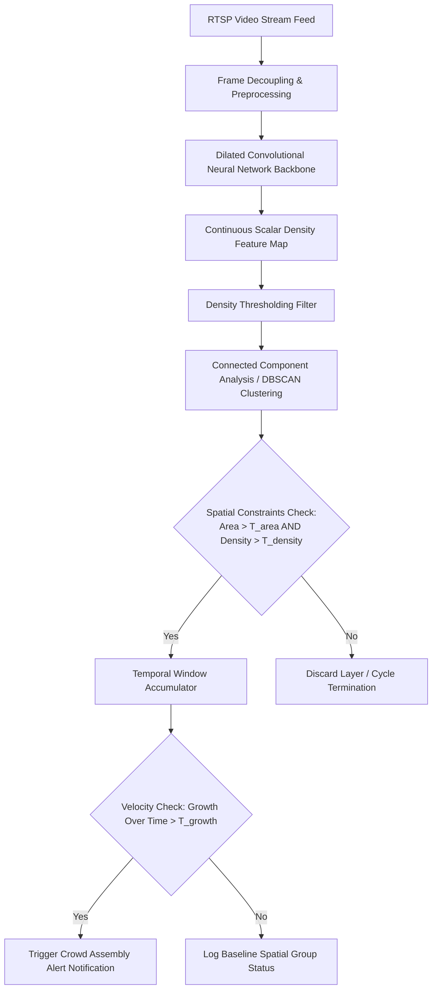
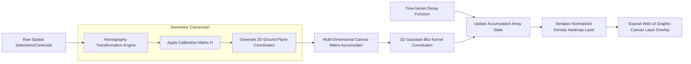
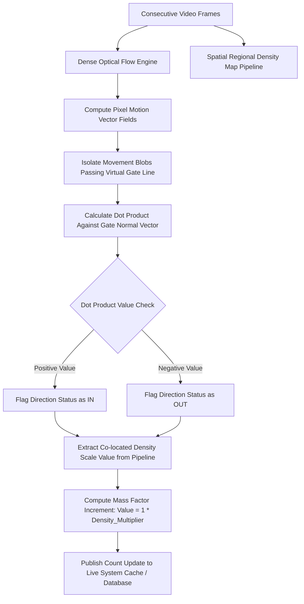

```mermaid
sequenceDiagram
    autonumber
    participant Pipeline as Real-time Vision Pipeline
    participant DB as Geo-Spatial Database (PostGIS/Elastic)
    participant API as Backend API Service
    participant UI as Web Operator Interface

    Loop Every Inference Frame Cycle
        Pipeline->>Pipeline: Extract Metadata (Centroids, Area, Density Score)
        Pipeline->>Pipeline: Drop Raw Image Byte Arrays
        Pipeline->>DB: Write Structured Geo-JSON Log with Temporal Index
    End

    rect rgb(0, 0, 0)
        Note over UI, DB: Asynchronous Operator Search Query Sequence
        UI->>API: Submit Spatial Bounding Area + Duration Filters
        API->>API: Translate Criteria into SQL Spatial Query (ST_Contains/ST_DWithin)
        API->>DB: Dispatch Geo-Query Statement
        DB-->>API: Return Filtered Rowset Matches (Timestamps, ID Arrays)
        API-->>UI: Deliver Component Data List & Matrix Graph Results
    End
```

## 1. STT 2: Crowd Gathering & Assembly Behavior Detection

### Functional Overview

Traditional object detection networks (e.g., individual bounding-box proposals) fail during dense crowding scenarios due to extreme structural occlusion and inter-object overlapping. This system leverages fully convolutional density estimation coupled with spatial clustering to recognize dangerous clumping patterns without needing to isolate individual bodies.

### Architectural Logic & Execution Workflow

1. **Feature Extraction:** Video frames are passed into a deep Convolutional Neural Network (CNN) backbone configured with dilated convolutions. Dilated convolutions expand the receptive field of filters without pooling downsampled data, preserving structural spatial constraints.
2. **Density Map Generation:** The network transforms the raw image array into a localized continuous scalar density map representing human spatial frequency per pixel channel.
3. **Cluster Spatial Segmentation:** Connected Component Analysis (CCA) or density-based clustering (such as DBSCAN) segments adjacent high-value zones into singular spatial entities.
4. **Temporal State Evaluation:** An accumulation window evaluates clusters across consecutive frames to confirm expanding growth velocity, separating stationary crowds from fast-forming gatherings.

### Pipeline Dataflow (Mermaid)

## 2. STT 14: People Density Tracking Over Time (Heatmaps)

### Functional Overview

Camera views introduce deep perspective distortion where foreground objects cover massive pixel counts compared to matching scale shapes deep in the background. This module projects raw 2D image coordinates onto a uniform 2D real-world coordinates floor map via geometric matrix transformations, generating normalized long-term spatial duration charts.

### Architectural Logic & Execution Workflow

1. **Homography Calibration:** During initial hardware deployment, a perspective transformation matrix ($\mathbf{H}$) is calibrated by assigning four non-collinear image coordinate points $(x, y)$ to real-world metric values or relative floorplan points $(X, Y)$.
2. **Coordinate Matrix Mapping:** For every frame processing cycle, individual centroid coordinates or density-map peaks are multiplied by the transformation matrix:

   $$\begin{bmatrix} X_{real} \\ Y_{real} \\ 1 \end{bmatrix} = \mathbf{H} \begin{bmatrix} x_{pixel} \\ y_{pixel} \\ 1 \end{bmatrix}$$

3. **2D Canvas Layering:** The resulting real-world coordinate sets map directly onto an internal multi-dimensional structural array matching the facility blueprint scale.
4. **Gaussian Convolution & Decay Processing:** Points are convolved with a 2D Gaussian Kernel to smooth pinpoint hits into unified heat zones. An exponential time-decay matrix multiplication script lowers historic pixel scores concurrently to represent localized drift dynamics accurately over rolling time windows.

### Pipeline Dataflow (Mermaid)

## 3. STT 15: Counting People Entering / Exiting an Area

### Functional Overview

Accurately maintaining bidirectional flow tallies within continuous crowded transit zones requires tracking aggregate movement velocities rather than individual paths, avoiding target dropouts when people walk behind each other.

### Architectural Logic & Execution Workflow

1. **Virtual Geometry Setup:** Operators draw digital evaluation vectors (Virtual Tripwire Gates) directly over key boundary areas on the camera canvas feed.
2. **Dense Optical Flow Generation:** A dense vector computation matrix (such as the Farneback variant) evaluates frame variations to compute a dense directional pixel displacement grid ($u, v$).
3. **Threshold Boundary Calculation:** Moving pixel groups passing over the virtual tripwire trigger a local vector evaluation slice. The system calculates the Dot Product ($\mathbf{A} \cdot \mathbf{B}$) between the dynamic group's movement direction vector and the virtual gate line's normal vector.
4. **Mass Volumetric Scale Factor Adjustment:** Rather than treating every tripwire crossing as a simple $+1$ change, the system checks the corresponding density estimation value at those exact coordinates. The final count increments or decrements proportionally based on the calculated physical mass of the crossing group.

### Pipeline Dataflow (Mermaid)

## 4. STT 16: Context-Based Person Search

### Functional Overview

This component allows end users to perform rapid query searches over spatial metadata logs (e.g., locating instances where large crowds occupied specific zones for excessive durations) without requiring raw video storage or manual video playback analysis.

### Architectural Logic & Execution Workflow

1. **Metadata Stripping Pipeline:** During runtime inference execution, raw visual frame arrays are immediately dropped after processing. The system strips the visual metrics into lightweight, structured JavaScript Object Notation (JSON) format telemetry payloads.
2. **Geo-Spatial Database Indexing:** Telemetry entries are written directly into a high-throughput relational time-series database configured with coordinate geo-spatial mapping configurations (such as PostgreSQL extended via PostGIS or Elasticsearch Geo-points).
3. **Structured Spatial Inversion Queries:** When an administrator runs an investigation check over a defined zone map region, the web application backend maps the visual boundaries to coordinates and handles execution via native geo-bounding queries (e.g., `ST_Contains`, `ST_DWithin`).
4. **Output Compilation:** The query match instantly identifies relevant event blocks, linking directly to lightweight log entries or specific video markers.

### Pipeline Dataflow (Mermaid)

