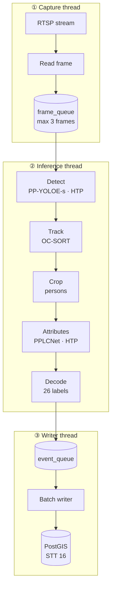
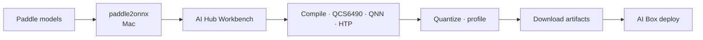

# PP-Human Attribute Recognition — QNN (Primary)

RTSP video pipeline on Qualcomm AI Box **QCS6490**: detection, tracking, attribute analysis via **QNN** + pybind11.

**Model conversion:** [AI Hub Workbench](https://aihub.qualcomm.com/get-started#workbench) only — no local QNN SDK, no Ubuntu VM.

Legacy SNPE approach: [PP-Human Attribute SNPE QCS6490 Legacy.md](PP-Human%20Attribute%20SNPE%20QCS6490%20Legacy.md)

Related:
- [PP-Human Attribute](../PaddleDetection/deploy/pipeline/docs/tutorials/pphuman_attribute_en.md)
- [PP-Human MOT](../PaddleDetection/deploy/pipeline/docs/tutorials/pphuman_mot_en.md)
- [STT 16: Context-Based Person Search](Crowd%20Analytics%20and%20Spatial%20Intelligence.md#4-stt-16-context-based-person-search)

---

## 1. Scope

| In scope | Out of scope (later) |
|----------|----------------------|
| RTSP video | Single-image mode |
| PP-YOLOE-s + OC-SORT + PPLCNet attr | MTMCT / ReID |
| pybind11 QNN runtime | PaddlePaddle on device |
| STT 16 metadata events | Full PostGIS schema |
| AI Hub Workbench conversion | Local QNN SDK / Ubuntu VM |

```
RTSP → detect (QNN HTP) → track (OC-SORT) → crop → attributes (QNN HTP) → metadata
```

---

## 2. Hardware & runtime

| Component | Role |
|-----------|------|
| Kryo 670 CPU | OC-SORT, preprocess/postprocess, RTSP, DB writer |
| Hexagon HTP v68 | **Primary inference** (12 TOPS) |
| Adreno 643 GPU | Fallback if HTP op unsupported |

**AI Box OS:** Ubuntu 24.04 (DSP/HTP stack expected to work after upgrade from 20).

| Runtime | Use | QNN backend |
|---------|-----|-------------|
| **HTP** | Production | `libQnnHtp.so` + `.serialized.bin` |
| GPU | Fallback | `libQnnGpu.so` |
| CPU | Parity debug | `libQnnCpu.so` |

Priority: **HTP → GPU → CPU**.

After OS upgrade, smoke-test HTP on device with artifacts from AI Hub before building the full pipeline.

---

## 3. Models

| Role | Model |
|------|-------|
| Detection + MOT | **PP-YOLOE-s** — `mot_ppyoloe_s_36e_pipeline` |
| Attribute | **PP-LCNet x1.0** — `PPLCNet_x1_0_person_attribute_945_infer` |

26-dim output decoded via `pphuman/attr_infer.py` `postprocess()`.

---

## 4. Architecture

### 4.1 Stack

```
Python pipeline (edit on Mac, run on AI Box)
  ├─ RTSP capture thread
  ├─ Inference thread  (QNN HTP: det → track → attr)
  └─ Writer thread     (STT 16 → PostGIS)
        ↕ pybind11: qnn_runtime
AI Box — libQnnHtp.so, model .so, context .bin
```

### 4.2 Pipeline dataflow



### 4.3 Threading

3-thread in-process queue (not MQTT for v1):

1. Capture → `frame_queue` (max 3, drop oldest)
2. Inference → `event_queue`
3. Writer → PostGIS batch insert

### 4.4 STT 16 metadata

Emit per track (on attribute change or every K frames): `timestamp`, `camera_id`, `track_id`, `bbox`, `centroid`, `attributes`, `attr_scores`. No raw frames.

---

## 5. Environments

| Machine | Role |
|---------|------|
| **Mac** | Repo edit, `paddle2onnx` export, optional `qai-hub` client |
| **AI Hub Workbench** | Compile, quantize, profile, download QNN artifacts |
| **AI Box Ubuntu 24** | Build `qnn_runtime` natively, run RTSP pipeline |

No Ubuntu VM. No local QNN SDK for conversion — AI Hub handles ONNX → QNN → HTP context.

**pybind11 binding:** build **on the AI Box** (native aarch64). QNN runtime libs ship with the BSP or AI Hub deploy bundle.

---

## 6. Model conversion (AI Hub Workbench only)



### 6.1 Mac — Paddle → ONNX (only local conversion step)

1. Download model zips from PaddleDetection links
2. `paddle2onnx` (opset 11)
3. Validate in Netron — record input name, shape, output tensors
4. Prefer **w/ NMS** ONNX for detection; fall back to wo/NMS if AI Hub rejects

### 6.2 AI Hub — per model (`ppyoloe_mot`, `pplcnet_attr`)

1. Create account + API token ([Get Started](https://aihub.qualcomm.com/get-started#workbench))
2. Upload ONNX
3. Target: **QCS6490** · runtime **QNN** · backend **HTP** · precision **INT8**
4. **Compile job**
5. **Quantize job** — upload 50–100 calibration samples (RTSP frames for det, person crops for attr), preprocessed like runtime
6. **Re-compile** quantized model for device (includes HTP graph optimization — no manual `qnn-context-binary-generator`)
7. **Inference + profile jobs** on cloud-hosted QCS6490 — check latency and compute unit
8. **Download** — expect `.so` model lib + serialized context `.bin`; record tensor names from job report

Optional: automate repeat jobs with `pip install qai-hub` + `qai-hub configure` from Mac.

### 6.3 AI Box — smoke test

Deploy downloaded artifacts. Confirm load + execute with `qnn-net-run` (or first `qnn_runtime` Python call) before full pipeline integration.

---

## 7. Project layout

```
qnn-pphuman-pipeline/
├── bindings/           # qnn_runtime pybind11 — build on AI Box
├── config/
│   ├── infer_cfg_qnn.yml
│   └── tracker_config.yml
├── models/             # AI Hub downloads (gitignored)
├── src/
│   ├── qnn_engine.py
│   ├── rtsp_capture.py
│   ├── det_engine.py
│   ├── tracker.py
│   ├── attr_engine.py
│   ├── crop_utils.py
│   ├── metadata.py
│   ├── db_writer.py
│   └── pipeline.py
└── tools/
    ├── generate_calib_list.py   # prep tensors for AI Hub quantize upload
    └── validate_parity.py
```

---

## 8. Config sketch

```yaml
rtsp_url: "rtsp://..."
camera_id: "cam_01"
skip_frame_num: 1
frame_queue_size: 3

MOT:
  backend: HTP
  model_lib: models/libppyoloe_mot_quantized.so
  context_bin: models/ppyoloe_mot.serialized.bin
  input_size: [640, 640]

ATTR:
  backend: HTP
  model_lib: models/libpplcnet_attr_quantized.so
  context_bin: models/pplcnet_attr.serialized.bin
  batch_size: 8

DB:
  enable: false
```

Paths and tensor names come from AI Hub compile report.

---

## 9. Code to port

| Module | Source | Change |
|--------|--------|--------|
| QNN binding | New (reference `snpe-yolov7-inference` pybind11 pattern) | QNN C API |
| Preprocess, tracker, crop, attr decode | PaddleDetection deploy | None |
| Pipeline | `deploy/pipeline/pipeline.py` flow | `QNNEngine` instead of Paddle |

---

## 10. Phases

| Phase | Tasks |
|-------|-------|
| **0 — Bring-up** | AI Box Ubuntu 24; HTP smoke test; RTSP test |
| **1 — Models** | Mac paddle2onnx → AI Hub compile/quantize/profile → download |
| **2 — Binding** | `qnn_runtime` pybind11 on AI Box |
| **3 — Det + track** | `det_engine.py`, OC-SORT, parity check |
| **4 — Attr** | Batched HTP + postprocess |
| **5 — RTSP** | 3-thread pipeline end-to-end |
| **6 — STT 16** | `PersonEvent` → PostGIS writer |

---

## 11. Performance targets (HTP INT8, 1080p)

| Component | Target |
|-----------|--------|
| Detection | < 25 ms/frame |
| Tracking | < 5 ms |
| Attribute | < 3 ms/person (batched) |
| End-to-end | 15–25 FPS (1 cam, 3–5 persons) |

---

## 12. Risks

| Risk | Mitigation |
|------|------------|
| HTP fails on device | GPU fallback via AI Hub recompile; check BSP `ADSP_LIBRARY_PATH` |
| AI Hub rejects PP-YOLOE | wo/NMS ONNX + Python NMS; onnx-simplifier |
| Wrong artifact type | Select **QNN** runtime in Workbench, not SNPE/TFLite |
| INT8 hurts attribute accuracy | More calibration crops; re-quantize on AI Hub |
| AI Hub unavailable | See legacy SNPE plan as interim only |

---

## 13. Decisions

| Decision | Choice |
|----------|--------|
| Inference | QNN + pybind11 |
| Conversion | **AI Hub Workbench only** |
| Local dev | Mac (ONNX export + code); **no Ubuntu VM** |
| Binding build | Native on AI Box |
| Runtime | HTP INT8 primary |
| Models | PP-YOLOE-s + PPLCNet |
| Threading | 3-thread queue → STT 16 |

---

## 14. Next actions

1. AI Box: Ubuntu 24 + HTP validation
2. Mac: download Paddle models → `paddle2onnx` → Netron check
3. AI Hub: compile both models for QCS6490 / QNN / HTP → download
4. AI Box: smoke test artifacts → scaffold `qnn-pphuman-pipeline/`
