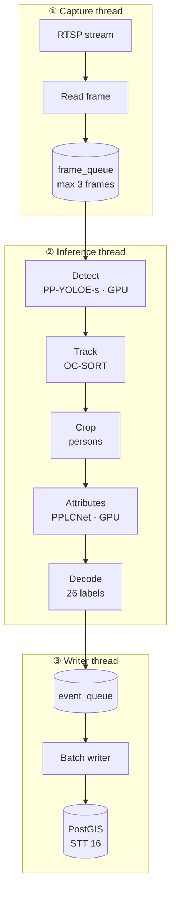
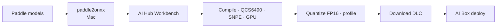

# PP-Human Attribute Recognition — SNPE (Legacy)

> **Superseded by** [PP-Human Attribute QNN QCS6490.md](PP-Human%20Attribute%20QNN%20QCS6490.md). Use this only as an interim path if QNN bring-up is blocked.

RTSP pipeline on QCS6490 using **SNPE** + pybind11. Model conversion via **AI Hub Workbench** only (no local SNPE SDK, no Ubuntu VM).

Reference implementation pattern: [snpe-yolov7-inference](../snpe-yolov7-inference/)

---

## When to use

- QNN artifacts or HTP path not ready yet
- Need a working GPU baseline quickly
- AI Hub compiles to SNPE DLC but not QNN for a specific model

**Do not invest in SNPE HTP / `snpe-dlc-graph-prepare`** — migrate to QNN for DSP acceleration.

---

## 1. Scope

Same functional scope as QNN plan: RTSP → PP-YOLOE-s detect → OC-SORT → PPLCNet attr → STT 16 metadata.

| Stack piece | Choice |
|-------------|--------|
| Runtime API | SNPE C++ via pybind11 `snpe_runtime` |
| Model artifact | `.dlc` from AI Hub |
| Primary runtime | **GPU** (FP16) — DSP failed on Ubuntu 20; may work on Ubuntu 24 but QNN is preferred for HTP |
| Conversion | AI Hub Workbench → SNPE DLC |

---

## 2. Runtime (historical)

Platform validator on Ubuntu 20 reported:

| Runtime | Status |
|---------|--------|
| GPU | Passed |
| DSP / HTP | Failed |
| CPU | Available (debug only) |

Production config used **GPU only**: `runtime: GPU`, `setCPUFallbackMode(true)`.

If Ubuntu 24 fixes DSP for SNPE, still prefer migrating to QNN rather than SNPE HTP.

---

## 3. Models

Same as QNN plan:

- **PP-YOLOE-s** (`mot_ppyoloe_s_36e_pipeline`)
- **PPLCNet x1.0** (`PPLCNet_x1_0_person_attribute_945_infer`)

---

## 4. Pipeline dataflow

Identical 3-thread layout to QNN plan — only inference backend differs (SNPE GPU DLC instead of QNN HTP).



---

## 5. Model conversion (AI Hub Workbench only)



1. **Mac:** `paddle2onnx` → validate in Netron
2. **AI Hub:** upload ONNX → target **QCS6490** · runtime **SNPE** (or GPU) · **FP16**
3. Quantize with calibration frames (RTSP det) + person crops (attr)
4. Re-compile → download **`.dlc`**
5. **AI Box:** `snpe-net-run --use_gpu` smoke test

---

## 6. Project layout

```
snpe-pphuman-pipeline/
├── bindings/           # snpe_runtime — build on AI Box
├── config/infer_cfg_snpe.yml
├── models/*.dlc        # AI Hub downloads
└── src/                # same Python modules as QNN plan, SNPEEngine wrapper
```

Binding adapted from `snpe-yolov7-inference/src/SNPEPipeline.cpp`:

```cpp
zdl::DlSystem::Runtime_t runtime = zdl::DlSystem::Runtime_t::GPU;
snpe_builder.setRuntimeProcessor(runtime)
            .setCPUFallbackMode(true)
            .build();
```

---

## 7. Config sketch

```yaml
MOT:
  runtime: GPU
  dlc_path: models/ppyoloe_mot.dlc
  input_size: [640, 640]

ATTR:
  runtime: GPU
  dlc_path: models/pplcnet_attr.dlc
  batch_size: 8

skip_frame_num: 2    # GPU-only — detect every 3rd frame
```

---

## 8. Performance (GPU FP16, conservative)

| Component | Target |
|-----------|--------|
| End-to-end | 8–12 FPS |
| Detection | < 50 ms/frame |

Lower than QNN HTP targets — expect to migrate.

---

## 9. Migration to QNN

| SNPE legacy | QNN primary |
|-------------|-------------|
| `.dlc` | `.so` + `.serialized.bin` |
| `snpe_runtime` | `qnn_runtime` |
| `snpe-net-run` | `qnn-net-run` |
| AI Hub SNPE/GPU | AI Hub QNN/HTP |
| GPU primary | HTP primary |

Python pipeline code (tracker, crop, attr decode, STT 16) transfers unchanged.

---

## 10. Next actions (if using legacy path)

1. Mac: `paddle2onnx` both models
2. AI Hub: SNPE + GPU compile → download DLCs
3. AI Box: `snpe-net-run --use_gpu` smoke test
4. Scaffold `snpe-pphuman-pipeline/` from `snpe-yolov7-inference`
5. Plan QNN migration per [primary plan](PP-Human%20Attribute%20QNN%20QCS6490.md)
